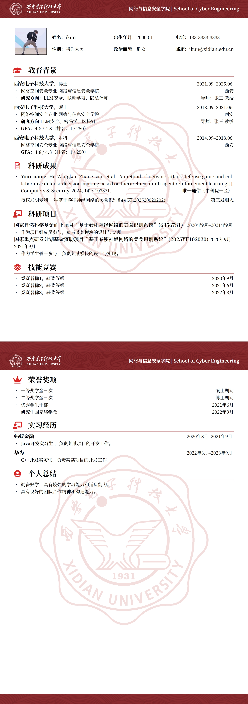

# XDU：西安电子科技大学 LaTeX 中文简历模板

## 简介
基于 
[NBU：宁波大学 LaTeX 中文简历模板](https://www.overleaf.com/latex/templates/nbu-zhu-bo-da-xue-latex-zhong-wen-jian-li-mo-ban/rwxqrsptnxtq)
以及
[SEU-CV：东南大学 LaTeX 中文简历模板](https://github.com/Exception0x0194/SEU-CV?tab=readme-ov-file) 
的 XDU 中文 CV 模板。

在原有内容的基础上进行了修改：

- 更改了校徽图标
- 可选择红色和蓝色两个主题(通过`\setThemeRed`或`\setThemeBlue`设置)
- 通过命令`\AddToShipoutPictureBG`增加了每一页的页眉页脚以及背景LOGO

仍存在一个小问题:

- 第一页的LOGO无法设置透明度(可能是PDF渲染问题), 建议编译输出的<mark>PDF去掉第一页</mark>.

## 使用方法

- 建议直接使用overleaf，并使用 `XeLaTeX` 编译
- 编辑 `main.tex` 中的内容，对文档样式和内容进行修改

## 示例

